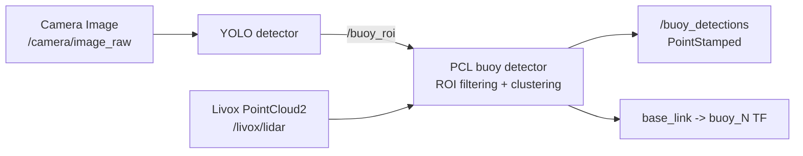

# Buoy Perception Pipeline

The buoy perception pipeline combines camera classification with LiDAR
clustering.



## ROI contract

`njord_interfaces/msg/BuoyRoi` describes an angular and radial search region:

- `r_predict` and `r_range`: predicted range and half-width in metres
- `theta_predict` and `theta_range`: predicted bearing and half-width in radians
- `header`: timestamp and frame used for the prediction

The YOLO node currently estimates range from a configurable fixed value. This
is intentionally a coarse proposal; the PCL detector uses LiDAR points to
produce the final position.

## Launch

Run CPU YOLO using the existing launch file, or CUDA YOLO with:

```bash
ros2 launch yolo yolo_cuda.launch.py
```

Run the LiDAR detector with:

```bash
ros2 launch pcl_det pcl_bouy_det.launch.py
```

The detector ignores stale ROI messages and transforms both the ROI direction
and clustered centroids through TF.

## Validation boundary

CI builds the interface, YOLO package, and C++ PCL detector. Camera, CUDA,
model accuracy, and live LiDAR alignment require hardware validation.
