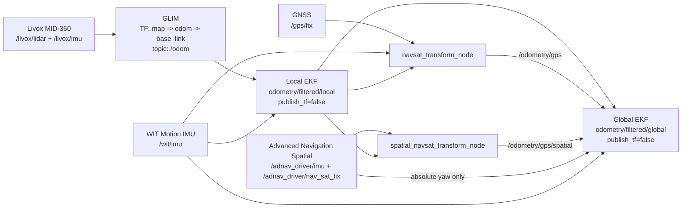

# Localization and TF Ownership

This document records the localization architecture reconstructed from the
latest commits on the historical `4-task1` branch.

## Decision

There is no `glim_base_link` frame in the latest implementation.

On the real robot, GLIM uses `base_link` as its base frame and owns the
dynamic TF chain:

```text
map -> odom -> base_link
```

The local and global EKF nodes publish filtered odometry topics, but both use
`publish_tf: false`. This avoids multiple nodes publishing the same dynamic TF
edges.

In Task3 simulation, the simulation dynamics node owns the equivalent TF
chain. The EKF nodes remain topic-only there as well.

## Real-robot data flow



## Static sensor frames

`robot_state_publisher` expands `robot.urdf.xacro` and publishes the static
sensor transforms below `base_link`. GLIM is configured with:

```text
imu_frame_id: livox_frame
lidar_frame_id: livox_frame
base_frame_id: base_link
publish_imu2lidar: false
```

Because the MID-360 supplies both LiDAR and IMU data in `livox_frame`, GLIM
must not publish a second IMU-to-LiDAR transform.

## Launch responsibilities

Run the localization stack with:

```bash
ros2 launch robot localization.launch.py
```

The launch starts the Advanced Navigation Spatial serial driver, GLIM, both
EKFs, both `navsat_transform_node` instances,
`robot_state_publisher`, and the static `base_link -> um982_link` transform.
The Spatial driver defaults to `/dev/ttyUSB1` at 1 Mbps.

## Spatial integration limitations

The installed unit has a `v8.0` label, but its exact product variant, firmware,
and Device Information packet still need to be recorded. The initial
`base_link -> spatial_link` transform is deliberately a zero placeholder even
though the unit is mounted separately. Measure and update it before localization
tuning.

The upstream driver hard-codes `imu_link` as the frame ID for both IMU and GNSS
messages. A team-maintained fork should expose this as a `frame_id` parameter
and use `spatial_link`; until then, validate the resulting TF lookups on the
robot. Only Spatial GNSS position and absolute yaw are fused initially. Do not
enable its velocity, angular velocity, or acceleration until ENU/FLU axis
conventions and covariances have been verified.

## Validation notes

This reconstruction was checked statically. It still requires validation on a
ROS 2 machine with GLIM and the sensors installed:

```bash
ros2 run tf2_tools view_frames
ros2 topic echo /odom
ros2 topic echo /odometry/filtered/local
ros2 topic echo /odometry/filtered/global
ros2 topic echo /adnav_driver/system_status
ros2 topic echo /adnav_driver/filter_status
ros2 topic hz /adnav_driver/imu
ros2 topic hz /adnav_driver/nav_sat_fix
```

The TF graph must have only one publisher for each dynamic edge.
