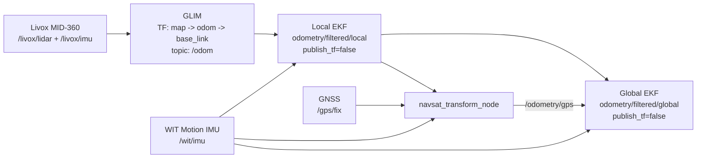

# Localization and TF Ownership

This document records the localization architecture reconstructed from the
latest commits on the historical `4-task1` branch.

## Decision

There is no `glim_base_link` frame in the latest implementation.

On the real robot, GLIM uses `base_link` as its base frame and owns the
dynamic TF chain:

```text
map -> odom -> base_link
```

The local and global EKF nodes publish filtered odometry topics, but both use
`publish_tf: false`. This avoids multiple nodes publishing the same dynamic TF
edges.

In Task3 simulation, the simulation dynamics node owns the equivalent TF
chain. The EKF nodes remain topic-only there as well.

## Real-robot data flow



## Static sensor frames

`robot_state_publisher` expands `robot.urdf.xacro` and publishes the static
sensor transforms below `base_link`. GLIM is configured with:

```text
imu_frame_id: livox_frame
lidar_frame_id: livox_frame
base_frame_id: base_link
publish_imu2lidar: false
```

Because the MID-360 supplies both LiDAR and IMU data in `livox_frame`, GLIM
must not publish a second IMU-to-LiDAR transform.

## Launch responsibilities

Run the localization stack with:

```bash
ros2 launch robot localization.launch.py
```

The launch starts GLIM, both EKFs, `navsat_transform_node`,
`robot_state_publisher`, and the static `base_link -> um982_link` transform.
Hardware drivers remain separate because their transport and device settings
depend on the deployed machine.

## Validation notes

This reconstruction was checked statically. It still requires validation on a
ROS 2 machine with GLIM and the sensors installed:

```bash
ros2 run tf2_tools view_frames
ros2 topic echo /odom
ros2 topic echo /odometry/filtered/local
ros2 topic echo /odometry/filtered/global
```

The TF graph must have only one publisher for each dynamic edge.
