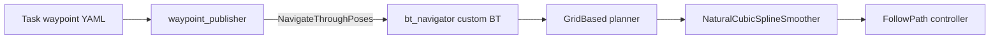

# Nav2 Waypoint and Smoothing Integration

## Pipeline



`waypoint_publisher` sends task-specific pose sequences through the Nav2
`NavigateThroughPoses` action. The custom behavior trees run `SmoothPath`
between path planning and path following.

## Launch

Start Nav2 with installed behavior-tree paths:

```bash
ros2 launch robot nav2.launch.py
```

Start a waypoint sequence:

```bash
ros2 launch waypoint_publisher waypoint_publisher.launch.py task_type:=task1
```

Supported task values are `task1`, `task2`, `task3_1`, and `task3_2`.

## Scope

This integration intentionally retains the existing generic planner,
controller frequency, robot radius, and costmap configuration. Task3-specific
planner and costmap tuning lives with the Task3 simulation integration.

The smoother currently performs geometric smoothing without collision
checking. Nav2 must validate and follow the resulting path against its
costmaps; parameters should be tuned conservatively for the ASV.
