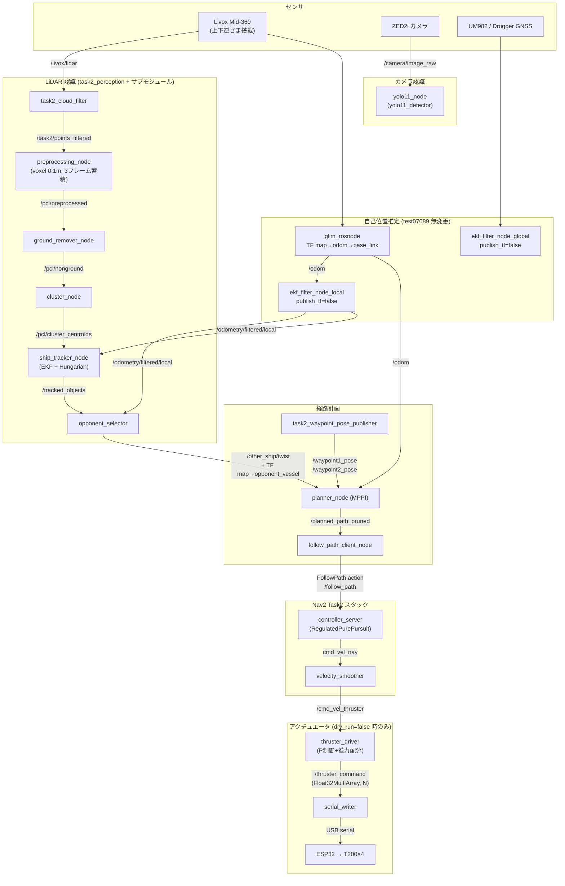
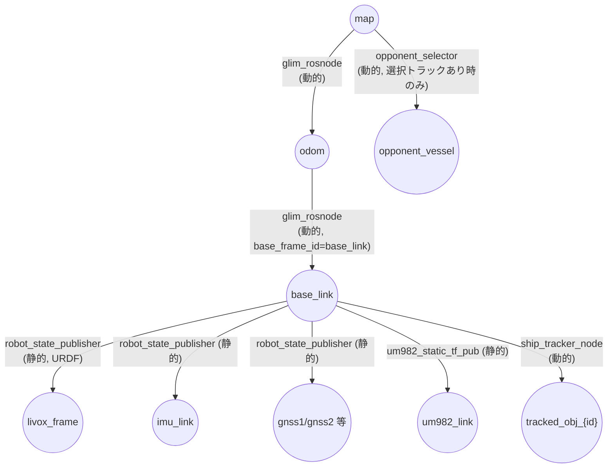

# Task 2 実験システム アーキテクチャ (task2-experiment)

- 作業日: 2026-07-19
- 対象ブランチ: `task2-experiment`(起点 `origin/test07089` tip `834f433`、tip `1647689`)
- 作業環境: Mac(ROS 2 環境なし。**すべて静的確認のみ。Jetson/実機では未確認**)
- 関連文書: `Docs/task2_mppi_integration_report.md`, `Docs/task2_parameter_reference.md`, `Docs/task2_file_map.md`, `Docs/task2_jetson_validation.md`, `Docs/task2_full_integration_report.md`

---

## 1. システム概要

Task 2(避航・衝突回避)を test07089 実機ハードウェアスタック上で実行するための統合システム。構成要素:

| サブシステム | 実装 | 状態 |
|---|---|---|
| 自己位置推定 | GLIM (`glim_rosnode`) + robot_localization EKF ×2(test07089 のまま無変更) | 既存・静的確認済み |
| カメラ認識 | `yolo11_node`(YOLO11s、標準 Ultralytics。既存 `yolo_node` と並置) | 新規・静的確認済み |
| LiDAR 前段フィルタ | `task2_cloud_filter`(task2_perception パッケージ) | 新規・合成データテスト済み |
| 他船追跡 | `pcl_segmentation` サブモジュール classical pipeline(**無改造・ポインタ db84af9 のまま**) | 既存再利用 |
| 追跡→MPPI グルー | `opponent_selector`(task2_perception) | 新規・合成データテスト済み |
| 経路計画 | MPPI (`planner_node`, asv_trajectory_planner)。パラメータ化済み・デフォルトは旧ハードコード値と同一 | 既存(mppi ブランチ由来)+パラメータ化 |
| 経路追従・安全 | Nav2(`navigation_launch_task2.py` + `nav2_params_task2.yaml`、RegulatedPurePursuit) | 既存 |
| スラスタ | `thruster_driver` → `serial_writer` → ESP32 → T200×4(test07089 とバイト単位で同一) | 既存・無変更 |
| 実機統合 launch | `task2_real.launch.py`(dry-run 三重ゲート付き) | 新規・静的テスト 14 件済み |

岸壁認識はTask 2の対象外となったため、feature/quay-perceptionブランチへ保存し、task2-experimentの認識・計画・制御ループから除外した。

設計原則:

1. **実機ハードウェア系(driver / real_bringup / nav2.launch.py / nav2_params.yaml)は test07089 と完全同一**(空 diff を確認済み)。
2. **サブモジュール `pcl_segmentation` は無改造**。入出力 topic を launch 引数で差し替えるだけで再利用する。
3. **LiDAR 上下逆さま補正は URDF の 1 箇所のみ**(`lidar_joint` roll=π、公称値・要実測)。
4. **安全側デフォルト**: `dry_run:=true` / `send_thruster_commands:=false` でスラスタ系は起動しない。
5. **安全な縮退**: 他船トラック喪失時は `/other_ship/twist` が沈黙し、MPPI は直進経路を出す(`require_other_ship: False`)。

## 2. 実機データフロー図



## 3. シミュレーションデータフロー図

シミュレーション(`task2_sim.launch.py`)は今回の統合で**構成不変**。認識パイプラインの代わりにシミュ専用ブリッジが同一インターフェースを供給する。

```mermaid
flowchart TB
    subgraph sim_bridge[シミュ専用ノード]
        OV[opponent_vessel_node]
        IL[ideal_lidar_pointcloud_node]
        OT["opponent_twist_from_tf_node<br/>(TF→/other_ship/twist)"]
        GW["task2_gps_waypoint_publisher<br/>(/sim/task2_gps_markers→waypoint)"]
        ADP[sim_thruster_command_adapter]
        DYN[dutyed_tf_pub_with_disturbance]
    end

    subgraph plan[経路計画・Nav2・スラスタ(実機と同一コード)]
        MPPI["planner_node (MPPI)"]
        FPC[follow_path_client_node]
        NAV["Nav2 Task2<br/>(navigation_launch_task2.py)"]
        TD[thruster_driver]
    end

    OV -->|TF map→opponent_vessel| OT
    OT -->|/other_ship/twist| MPPI
    GW -->|"/waypoint1_pose /waypoint2_pose"| MPPI
    IL -->|"/pointcloud<br/>(Nav2 obstacle layer)"| NAV
    DYN -->|/odom + TF| MPPI

    MPPI -->|/planned_path_pruned| FPC
    FPC -->|/follow_path| NAV
    NAV -->|/cmd_vel_thruster| TD
    TD -->|"/thruster_command (Float32, N)"| ADP
    ADP -->|"/sim/thruster_duty (Int16MultiArray)"| DYN
```

シミュ専用 6 ノード(`opponent_twist_from_tf_node`, `task2_gps_waypoint_publisher`, `opponent_vessel_node`, `ideal_lidar_pointcloud_node`, `dutyed_tf_pub_with_disturbance`, `sim_thruster_command_adapter`)は `task2_real.launch.py` から起動されないことを静的テスト(`test_no_sim_only_executables_in_code`)で保証している。

## 4. ファイル・パッケージ構成

今回の統合で追加・変更された範囲(全ファイル一覧は `Docs/task2_file_map.md`):

```
src/
├── detection/
│   ├── task2_perception/            # 新規パッケージ (Python)
│   │   ├── task2_perception/        #   cloud_filter_node.py, opponent_selector_node.py
│   │   │                            #   + 純Python 3 モジュール
│   │   ├── config/task2_params.yaml
│   │   ├── launch/task2_perception.launch.py
│   │   └── test/                    #   pytest 26 件 (ROS 不要)
│   ├── yolo/                        # 既存パッケージへ並置追加
│   │   ├── yolo/yolo11_node.py      #   新規 YOLO11s ノード (main.py は無変更)
│   │   ├── config/yolo11s_params.yaml
│   │   ├── launch/yolo11s.launch.py
│   │   └── requirements_jetson_yolo11.txt
│   └── pcl_segmentation/            # サブモジュール (db84af9, 無変更)
├── navigation/path_generator/
│   ├── mppi/                        # asv_trajectory_planner (mppi ブランチ由来)
│   │   ├── asv_trajectory_planner/  #   planner_node.py, mppi_torch.py, crm_torch.py,
│   │   │                            #   task2_waypoint_pose_publisher.py(新規)
│   │   ├── config/mppi_params.yaml  #   新規 (デフォルト=旧ハードコード値)
│   │   └── launch/planner_real.launch.py(新規), planner_with_follow_path.launch.py
│   └── waypoint_publisher/          # task2_gate_midpoint_publisher 追加 (未接続の代替案)
├── robot/
│   ├── launch/task2_real.launch.py  # 新規 実機統合エントリポイント
│   ├── launch/navigation_launch_task2.py
│   ├── config/nav2_params_task2.yaml
│   ├── urdf/robot.urdf.xacro        # lidar_joint roll=π (公称・要実測)
│   └── test/test_task2_real_launch_static.py  # 静的テスト 14 件
└── sim/task2_sim/                   # シミュ (MPPI 統合時の構成のまま)
scripts/
├── task2/  # task2_jetson_preflight.sh, task2_static_check.sh,
│           # benchmark_mppi.py, benchmark_yolo11s.py, record_task2_bag.sh
└── yolo/   # export_yolo11s_tensorrt.py (Jetson 専用)
```

## 5. 各ノードの役割

| ノード名 (executable) | パッケージ | 役割 |
|---|---|---|
| `task2_cloud_filter` (`task2_cloud_filter_node`) | task2_perception | `/livox/lidar` を TF で base_link へ変換し、非有限値・レンジ・自船クロップ・高さバンド・水面除去を適用して `/task2/points_filtered` を出力 |
| `preprocessing_node` | pcl_preprocessing (サブモジュール) | voxel 0.1 m ダウンサンプル・ROI・3 フレーム蓄積 → `/pcl/preprocessed` |
| `ground_remover_node` | pcl_segmentation (サブモジュール) | 地面(水面)除去 → `/pcl/nonground` |
| `cluster_node` | pcl_segmentation (サブモジュール) | クラスタリング → `/pcl/cluster_centroids` (PoseArray) |
| `ship_tracker_node` | ship_tracking (サブモジュール) | EKF + Hungarian 対応付け → `/tracked_objects` + TF `base_link→tracked_obj_{id}`。**twist は物体 body frame・相対速度**(内部の ego 補償は no-op スタブ) |
| `opponent_selector` (`opponent_selector_node`) | task2_perception | トラックのゲーティング(confirmed / 距離 / 寸法 / 点数 / 鮮度)→ policy 選択 → body→base_link 回転 → ego 補償 → map 変換 → ローパス+スパイク除去 → `/other_ship/twist` + TF `map→opponent_vessel` |
| `yolo11_detector` (`yolo11_node`) | yolo | YOLO11s 推論(pytorch/.pt または tensorrt/.engine)→ `/yolo/detections` + `/buoy_roi` + `yolo/debug_image` |
| `task2_waypoint_pose_publisher` | asv_trajectory_planner | `share/waypoint_publisher/config/task2_waypoints.yaml`(map 座標 x/y は事前計算済み・lat/lon はメタデータ)の start/goal を `/waypoint1_pose` `/waypoint2_pose` として 2 Hz 配信 |
| `planner_node` | asv_trajectory_planner | MPPI(horizon 225 × dt 0.1 s、5000 サンプル)で避航経路を生成 → `/planned_path_pruned` |
| `path_pruner_node` | asv_trajectory_planner | 実機/シミュとも起動されるが、planner が直接 `/planned_path_pruned` に出すため実質バイパス(入力 `/planned_path` は誰も出さない) |
| `follow_path_client_node` | asv_trajectory_planner | `/planned_path_pruned` を Nav2 `FollowPath` action goal として送信(1 Hz、再計画あり) |
| Nav2 各サーバ | nav2_* | `navigation_launch_task2.py` が非 compose で起動。controller / smoother / planner / behavior / bt_navigator / waypoint_follower / velocity_smoother + lifecycle_manager |
| `thruster_driver_node` | thruster_driver | `/cmd_vel_thruster` → P 制御(surge/sway 28.29, yaw 12.17)→ wrench クランプ(6/6/3 N)→ 推力配分 → `/thruster_command` (Float32MultiArray, N) |
| `serial_writer` | micon_driver_fd | `/thruster_command` を ESP32 へ USB シリアル送信 |
| `glim_rosnode` | glim_ros | LiDAR-IMU オドメトリ。`/glim_node/odom`→`/odom` リマップ。TF `map→odom→base_link` の唯一の所有者 |

## 6. ノード間接続

実機での接続関係(A → topic → B):

| 出力ノード | topic / IF | 入力ノード |
|---|---|---|
| livox_ros_driver2 | `/livox/lidar` | task2_cloud_filter, glim_rosnode |
| task2_cloud_filter | `/task2/points_filtered` | preprocessing_node(launch 引数 `lidar_topic` で接続) |
| preprocessing_node | `/pcl/preprocessed` | ground_remover_node |
| ground_remover_node | `/pcl/nonground` | cluster_node |
| cluster_node | `/pcl/cluster_centroids` | ship_tracker_node |
| ship_tracker_node | `/tracked_objects` | opponent_selector |
| ekf_filter_node_local | `/odometry/filtered/local` | opponent_selector, ship_tracker_node(`ego_odom_topic`) |
| opponent_selector | `/other_ship/twist` + TF `map→opponent_vessel` | planner_node |
| task2_waypoint_pose_publisher | `/waypoint1_pose`, `/waypoint2_pose` | planner_node |
| glim_rosnode | `/odom` | planner_node(`own_odom_topic`), path_pruner_node, velocity_smoother |
| planner_node | `/planned_path_pruned` | follow_path_client_node |
| follow_path_client_node | `/follow_path` (FollowPath action) | controller_server |
| controller_server | `cmd_vel`→`cmd_vel_nav` リマップ | velocity_smoother |
| velocity_smoother | `cmd_vel_smoothed`→`/cmd_vel_thruster` リマップ | thruster_driver_node |
| thruster_driver_node | `/thruster_command` | serial_writer |
| zed2i_driver | `/camera/image_raw` | yolo11_detector |
| yolo11_detector | `/yolo/detections`, `/buoy_roi` | (Task 2 の制御ループには未接続。記録・監視用) |

注意: YOLO の出力は現時点で MPPI/Nav2 に**接続されていない**(ブイ検出は記録・将来の fusion 用)。

## 7. topic 一覧表

| topic | 型 | frame | 発行者 | 主な購読者 | 備考 |
|---|---|---|---|---|---|
| `/livox/lidar` | sensor_msgs/PointCloud2 | livox_frame | livox_ros_driver2 | task2_cloud_filter, GLIM | ~10 Hz, xyz+intensity |
| `/task2/points_filtered` | sensor_msgs/PointCloud2 | base_link | task2_cloud_filter | preprocessing_node | フィルタ済み雲 |
| `/task2/debug/raw_transformed` ほか `/task2/debug/*` | sensor_msgs/PointCloud2 | base_link | task2_cloud_filter | (デバッグ) | `publish_debug: true` 時のみ。raw_transformed / self_filtered / water_removed / rejected_water |
| `/pcl/preprocessed` | sensor_msgs/PointCloud2 | base_link | preprocessing_node | ground_remover_node | サブモジュール |
| `/pcl/nonground` | sensor_msgs/PointCloud2 | base_link | ground_remover_node | cluster_node | サブモジュール |
| `/pcl/cluster_centroids` | geometry_msgs/PoseArray | base_link | cluster_node | ship_tracker_node | サブモジュール |
| `/tracked_objects` | ship_perception_msgs/TrackedObjectArray | base_link(pose)/body(twist) | ship_tracker_node | opponent_selector | twist は相対・物体 body frame |
| `/odometry/filtered/local` | nav_msgs/Odometry | odom (child: base_link) | ekf_filter_node_local | opponent_selector, tracker | ego 補償に使用 |
| `/odometry/filtered/global` | nav_msgs/Odometry | map | ekf_filter_node_global | bt_navigator | |
| `/odom` | nav_msgs/Odometry | odom | glim_rosnode(リマップ) | planner_node ほか | 実機の own_odom |
| `/other_ship/twist` | geometry_msgs/TwistStamped | map | opponent_selector | planner_node | **絶対**対地速度。トラック喪失時は沈黙 |
| `/waypoint1_pose`, `/waypoint2_pose` | geometry_msgs/PoseStamped | map | task2_waypoint_pose_publisher | planner_node | 2 Hz |
| `/planned_path_pruned` | nav_msgs/Path | map | planner_node | follow_path_client_node | pruner はバイパス |
| `/planned_path` | nav_msgs/Path | map | (発行者なし・実機/シミュとも) | path_pruner_node | 予約配線 |
| `/follow_path` | nav2_msgs/action/FollowPath | - | follow_path_client_node (client) | controller_server (server) | 1 Hz で再送 |
| `cmd_vel_nav` | geometry_msgs/Twist | - | controller_server | velocity_smoother | Nav2 内部リマップ |
| `/cmd_vel_thruster` | geometry_msgs/Twist | - | velocity_smoother | thruster_driver_node | dry-run 時の観測点 |
| `/thruster_command` | std_msgs/Float32MultiArray | - | thruster_driver_node | serial_writer(実機)/ sim_thruster_command_adapter(シミュ) | 4 要素 [N]、FR/FL/RR/RL、force_per_duty 40 N |
| `/camera/image_raw` | sensor_msgs/Image | - | カメラドライバ | yolo11_detector | camera_topic パラメータで変更可 |
| `/yolo/detections` | vision_msgs/Detection2DArray | 画像 | yolo11_detector | (記録用) | 色は detection.id に格納 |
| `/buoy_roi` | njord_interfaces/BuoyRoi | base_link | yolo11_detector | (記録用) | 画素中心→方位、固定レンジ 5 m |
| `yolo/debug_image` | sensor_msgs/Image | - | yolo11_detector | RViz 等 | debug_image_hz でレート制限 |
| `/emg` | (test07089 既存) | - | 操縦系 | thruster 系 | ソフト E-stop(+ハードウェア E-stop) |
| シミュのみ: `/pointcloud` | sensor_msgs/PointCloud2 | - | ideal_lidar_pointcloud_node | Nav2 obstacle_layer | |
| シミュのみ: `/sim/thruster_duty` | std_msgs/Int16MultiArray | - | sim_thruster_command_adapter | dutyed_tf_pub_with_disturbance | duty = N / 40 × 1000 |

## 8. message 型一覧表

| 型 | 提供パッケージ | 用途 |
|---|---|---|
| sensor_msgs/PointCloud2 | sensor_msgs | 全点群 topic |
| sensor_msgs/Image, CameraInfo | sensor_msgs | カメラ入出力 |
| geometry_msgs/PoseStamped | geometry_msgs | waypoint |
| geometry_msgs/TwistStamped | geometry_msgs | `/other_ship/twist` |
| geometry_msgs/Twist | geometry_msgs | cmd_vel 系 |
| geometry_msgs/PoseArray | geometry_msgs | `/pcl/cluster_centroids` |
| nav_msgs/Odometry | nav_msgs | `/odom`, `/odometry/filtered/*` |
| nav_msgs/Path | nav_msgs | `/planned_path*` |
| visualization_msgs/MarkerArray | visualization_msgs | `/sim/task2_gps_markers`(シミュのみ) |
| vision_msgs/Detection2DArray, Detection2D, ObjectHypothesisWithPose | vision_msgs | YOLO 検出 |
| njord_interfaces/BuoyRoi | njord_interfaces | `/buoy_roi` |
| ship_perception_msgs/TrackedObjectArray, TrackedObject | ship_perception_msgs(**サブモジュール提供**) | `/tracked_objects`。`colcon build --packages-up-to ship_perception_msgs` を先に行うこと |
| std_msgs/Float32MultiArray | std_msgs | `/thruster_command` [N] |
| std_msgs/Int16MultiArray | std_msgs | `/sim/thruster_duty`(シミュのみ) |
| nav2_msgs/action/FollowPath | nav2_msgs | 経路追従 action |

## 9. TF ツリーと TF 所有者



| TF | 所有者 | 備考 |
|---|---|---|
| `map→odom`, `odom→base_link` | glim_rosnode | `glim_config/config_ros.json`: `base_frame_id: base_link`, `odom_frame_id: odom`, `map_frame_id: map` |
| `base_link→livox_frame` | robot_state_publisher(URDF `lidar_joint`) | **roll=π(公称)が上下逆さま Mid-360 の唯一の補正点。実測必須** |
| `base_link→センサ各 frame` | robot_state_publisher | URDF 静的 |
| EKF (`ekf_local` / `ekf_global`) | **TF を出さない**(`publish_tf: false`) | GLIM と競合しない |
| `map→opponent_vessel` | opponent_selector | 実機。シミュでは opponent_vessel_node 系 |
| `base_link→tracked_obj_{id}` | ship_tracker_node | サブモジュール |

## 10. 実機 launch 構成

エントリポイント: `ros2 launch robot task2_real.launch.py`

```
task2_real.launch.py
├── real_bringup.launch.py            (常時。enable_nav2:=false 固定)
│   ├── lidar.launch.py               [enable_mid360 ← enable_lidar]
│   ├── zed2i.launch.py               [enable_zed2i ← enable_camera]
│   ├── um982 / drogger / (imu)       (real_bringup デフォルトのまま)
│   ├── localization.launch.py        (robot_state_publisher, glim, EKF×2, navsat×2)
│   ├── thruster_driver.launch.py + serial_writer + bms
│   │                                 [enable_thruster ← 三重ゲート成立時のみ]
│   └── nav2.launch.py                (起動しない: enable_nav2=false)
├── yolo11s.launch.py                 [enable_yolo]  ※venv ガードあり
├── task2_perception.launch.py        [enable_lidar]
│     (enable_opponent_selector ← enable_ship_tracking)
├── classical_pipeline.launch.py      [enable_ship_tracking]
│     lidar_topic:=/task2/points_filtered
│     ego_odom_topic:=/odometry/filtered/local
├── planner_real.launch.py            [enable_mppi]
│     (task2_waypoint_pose_publisher, planner_node,
│      path_pruner_node, follow_path_client_node)
├── navigation_launch_task2.py        [enable_nav2]
│     params_file:=robot/config/nav2_params_task2.yaml
└── diagnostics.launch.py             [enable_debug_topics] (profile:=localization)
```

launch 引数(既定値): `enable_camera=true`, `enable_yolo=true`, `enable_lidar=true`, `enable_ship_tracking=true`, `enable_mppi=true`, `enable_nav2=true`, `enable_thrusters=true`, `enable_debug_topics=false`, `lidar_model=mid360s`, `yolo_backend=pytorch`, `yolo_model_path=<yolo share>/config/best.pt`, `use_tensorrt=false`, `use_int8=false`(予約・未使用), **`dry_run=true`**, **`send_thruster_commands=false`**。

注意点:

- `real_bringup` は diagnostics を含まないため、`enable_debug_topics` による diagnostics 起動と二重にならない。
- `yolo11s.launch.py` は `VIRTUAL_ENV` 未設定だと launch 記述生成時に RuntimeError を投げる(venv ガード)。venv なしで統合 launch を使う場合は `enable_yolo:=false` にすること。
- `use_tensorrt:=true` は `yolo_backend` の値に関係なく backend を `tensorrt` に強制する。

## 11. シミュレーション launch 構成

エントリポイント: `ros2 launch task2_sim task2_sim.launch.py`(MPPI 統合時から**無変更**)

TimerAction による段階起動:

| 遅延 | 起動内容 |
|---|---|
| `driver_delay` (0 s) | dutyed_tf_pub_with_disturbance(`topic_thruster_command:=/sim/thruster_duty`)、sim_thruster_command_adapter、sensor_noise、task2_orchestrator、thruster_driver_node、robot_state_publisher、EKF×2、navsat_transform |
| `nav2_delay` (2 s) | `navigation_launch_task2.py`(nav2_params_task2.yaml)[use_nav2] |
| `goal_delay` (3 s) | `planner_with_follow_path.launch.py`[use_mppi](シミュブリッジ 2 ノード込み)、waypoint_publisher[use_waypoints=false] |
| `opponent_delay` (10 s) | opponent_vessel_node、ideal_lidar_pointcloud_node |

## 12. YOLO 処理フロー

1. `/camera/image_raw` 受信 → `inference_hz`(既定 5 Hz)でレート制限(超過フレームは**キューせず破棄**)。
2. (オプション)`use_roi_crop` で画像の一部(分率指定)のみ切り出し。
3. Ultralytics `YOLO.predict()`(imgsz 640, conf 0.25, iou 0.45, max_det 20)。backend は model_path 拡張子で決まる: `.pt` = PyTorch(`use_half` で FP16)、`.engine` = TensorRT(精度はエンジン作成時に固定)。
4. bbox を全画像座標へ戻し、クラス名 → 色決定(`color_class_map` キーワード一致が優先、なければ HSV 推定)。
5. 出力: `/yolo/detections`(色は `detection.id`)、最良ブイ候補 1 件を `/buoy_roi`(画素中心→方位角、固定レンジ 5 m)、`yolo/debug_image`(2 Hz 制限)。
6. 重みは**リポジトリに含まれない**。ファイルが無い場合は fatal ログを出してクリーン終了する(自動ダウンロードしない)。TensorRT エンジンは Jetson 上で `scripts/yolo/export_yolo11s_tensorrt.py` により生成(FP16 既定、INT8 は `--calib-data` 必須)。venv 戦略は `Docs/yolo11s_jetson_setup.md` 参照。

## 13. LiDAR 処理フロー

```
/livox/lidar (livox_frame, ~10Hz)
  → task2_cloud_filter:
      ① 非有限値除去
      ② (緊急用手動プリ回転: 既定 no-op。有効時は起動時警告)
      ③ TF livox_frame→base_link 変換 (URDF が逆さま補正を保持)
      ④ レンジフィルタ 0.5–60 m
      ⑤ 自船クロップボックス除去 (x±1.2, y±0.8, z −0.5〜1.5 m — 公称・要実測)
      ⑥ 物体高さバンド keep (−0.2〜4.0 m)
      ⑦ 水面除去 (§14)
      ⑧ (voxel/蓄積は既定オフ — 下流サブモジュールと二重適用しない)
  → /task2/points_filtered (base_link)
  → サブモジュール classical_pipeline (無改造):
      preprocessing_node (voxel 0.1 m, 3 フレーム蓄積) → /pcl/preprocessed
      ground_remover_node → /pcl/nonground
      cluster_node → /pcl/cluster_centroids
      ship_tracker_node → /tracked_objects
```

TF が引けない場合: cloud stamp の TF → 最新 TF へフォールバック → それも不可ならフレームを破棄(警告スロットル付き)。

## 14. 水面除去処理

`task2_cloud_filter` 内、`cloud_ops.water_removal()`(純 numpy・テスト済み)。2 段構成:

1. **z バンド除去**: `waterline_z_m`(既定 0.0、**喫水と LiDAR 高さに依存・実測必須**)を基準に `water_remove_min_z_m`(−0.3)〜`water_remove_max_z_m`(+0.15)の帯を除去。
2. **ガード付き RANSAC 平面**(`use_water_plane_ransac: true`): 平面は次の両方を満たすときのみ水面として除去される。
   - 法線がほぼ鉛直: `normal_z >= water_plane_normal_z_min`(0.9)→ **鉛直な岸壁は誤って食われない**
   - 平面高さが waterline ±`water_plane_max_height_error_m`(0.3 m)以内 → **2 m 上のデッキ等は残る**

デバッグ: `publish_debug: true` で `/task2/debug/water_removed`(除去後)と `/task2/debug/rejected_water`(除去された点)を出力。

## 15. 他船追跡処理

- 追跡本体はサブモジュール `ship_tracker_node`(EKF + Hungarian、無改造)。出力 `/tracked_objects` の pose は base_link 相対、**twist は REP-103 に従い物体 body frame で表現された相対速度**(`ship_tracker_node.cpp` の twist 組み立てで yaw 回転を適用している。tracker 内部の ego 補償は no-op スタブ)。
- `opponent_selector` が MPPI との橋渡しを行う:
  1. ゲート: `confirmed_only`(track_state==1)、`stale_timeout_sec` 2.0 s、`max_distance_m` 60、長さ 0.5–30 m、`min_point_count` 5。
  2. ランク: `selection_policy` = `nearest`(水平距離)| `min_tcpa`(相対状態から CPA/TCPA 計算、発散目標は距離順で後回し)| `track_id`(指定 ID のみ)。top-1 を採用。
  3. 速度変換: body frame twist をトラック yaw で base_link 軸へ回転 → ego twist(`/odometry/filtered/local`、child frame = base_link)を**加算**(ego 補償)→ TF `map→base_link` で map 軸へ回転。位置推定の数値微分は**行わない**(EKF 速度をそのまま使う)。
  4. 平滑化: 一次 IIR ローパス(α=0.3)+ スパイクゲート(速度 > 5 m/s または yaw rate > 1.5 rad/s のサンプルは破棄)。選択トラックが変わるとフィルタをリセット。
  5. 出力: `/other_ship/twist`(TwistStamped, map frame, **絶対**対地速度)+ TF `map→opponent_vessel`。
- **縮退動作**: 有効トラックが無いときは何も publish しない(警告のみ)。MPPI は `require_other_ship: False` のため直進経路を出し続ける。

## 16. 岸壁認識(Task 2 対象外)

岸壁認識は Task 2 の対象外となり、実装一式(検出ノード・MPPI quay cost・Nav2 quay ソース)は feature/quay-perception ブランチに保存されている(§1 の注記参照)。

## 17. MPPI 接続

- `planner_node` の入力: `/odom`(own)、`/other_ship/twist` + TF `map→opponent_vessel`(other)、`/waypoint1_pose` `/waypoint2_pose`(GPS 基準線)。出力: `/planned_path_pruned`。
- 実機 launch(`planner_real.launch.py`)の要点:
  - `own_odom_topic:=/odom`(GLIM)、`other_ship_frame: opponent_vessel`、`require_other_ship: False`、`other_twist_is_relative: False`(認識側が map 絶対速度を出すため)。
  - MPPI ハイパーパラメータは `config/mppi_params.yaml` から読む。**全デフォルト = 旧ハードコード値**(horizon 225、dt 0.1 s、num_samples 5000、lambda 12.0、sigma [35, 0]、target_speed 1.02889 m/s = 2 kn、path_cost_weight 150、collision_cost_min/max 10/50、gate 3.0、buoy 120、speed 0.1、control 0.2、CRM 楕円ゲイン 右/左/前/後 = 3.2/1.6/6.4/1.6 LOA、loa 2.0、gate_half_width 4.0 m)。デフォルト値不変はテストで 25/25 確認済み。
  - topic 配線は `planner_with_follow_path.launch.py`(シミュ検証済み)と同一: planner が直接 `/planned_path_pruned` に publish し、`path_pruner_node` は起動されるが実質バイパス。
- 縮退: 他船情報なし → 直進経路(straight_path_length_m 60 m)を生成し続ける。

## 18. Nav2 接続

- Task 2 専用スタックを `navigation_launch_task2.py`(nav2_bringup の navigation_launch.py 相当を robot パッケージに保持)+ `nav2_params_task2.yaml` で起動。実機汎用の `nav2.launch.py` / `nav2_params.yaml` は**無変更**。
- 経路は planner(GridBased/ThetaStar)ではなく、`follow_path_client_node` からの `FollowPath` action で MPPI 経路を直接追従する。
- controller: `nav2_regulated_pure_pursuit_controller::RegulatedPurePursuitController`(desired_linear_vel 1.10、lookahead 3.0(1.2–6.0)、collision detection off)。
- costmap: local(rolling 30×30 m, 0.1 m)/ global(100×60 m, 0.2 m)ともに obstacle_layer の `observation_sources: pointcloud`。
  - `pointcloud`: `/pointcloud`(シミュの ideal LiDAR。実機では現状発行者なし = 空)。
- velocity_smoother: max_velocity [1.20, 0.0, 0.18]、`cmd_vel_smoothed`→`/cmd_vel_thruster`。
- bt_navigator の odom_topic は `/odometry/filtered/global`。

## 19. スラスタ制御経路

```
velocity_smoother → /cmd_vel_thruster (Twist)
  → thruster_driver_node (input_mode cmd_vel):
      P 制御 (surge 28.29, sway 28.29, yaw 12.17)
      wrench クランプ ±(surge 6 N, sway 6 N, yaw 3 N)
      推力配分 (regularization_lambda 1e-4)
  → /thruster_command (Float32MultiArray, 4 要素 [N], FR/FL/RR/RL,
                        force_per_duty 40 N, duty_resolution 1000)
  → serial_writer (micon_driver_fd, /dev/serial/by-id/usb-Silicon_Labs_CP2102N…, 115200 baud)
  → ESP32 → T200 ×4
```

test07089 とバイト単位で同一(diff 空を確認済み)。シミュのみ末尾が `sim_thruster_command_adapter` → `/sim/thruster_duty` → `dutyed_tf_pub_with_disturbance` に分岐。

## 20. fail-safe と dry-run

**三重ゲート**(`task2_real.launch.py`): real_bringup の `enable_thruster`(thruster_driver と serial_writer の**両方**をゲート)には、次の三条件がすべて成立したときのみ true が渡る。

```
enable_thrusters == true  AND  dry_run == false  AND  send_thruster_commands == true
```

| モード | 引数 | 挙動 |
|---|---|---|
| dry-run(**既定**) | `dry_run:=true`(既定)| Nav2 + MPPI は通常動作し `/cmd_vel_thruster` まで観測可能。thruster_driver / serial_writer は**起動すらしない** → `/thruster_command` は発行されず ESP32 へ 1 バイトも届かない |
| 実出力 | `dry_run:=false send_thruster_commands:=true`(enable_thrusters は既定 true のまま) | スラスタ駆動 |

その他の fail-safe:

- **他船喪失** → `/other_ship/twist` 沈黙 → MPPI 直進(安全縮退)。opponent_selector のスパイクゲートで異常速度サンプルは棄却。
- **E-stop**: `/emg` ソフト E-stop + ハードウェア E-stop(test07089 既存・無変更)。thruster_driver は feedback timeout(0.5 s)で停止(`stop_on_feedback_timeout: true`)。watchdog_timeout_sec 0.5。
- **YOLO 重み欠如** → fatal ログ + クリーン終了(他ノードは継続)。
- **TF 欠如** → cloud_filter はフレーム破棄、opponent_selector はそのサイクルをスキップ(警告スロットル)。
- 静的テスト(14 件)が安全既定値(dry_run true / send_thruster_commands false)と三重ゲート式、シミュ専用ノード非混入、岸壁認識の非再混入を CI 的に固定している。

**注意: 本書のすべての動作記述はコード静的解析に基づく。実行時挙動は Jetson/実機で未確認**(検証手順は `Docs/task2_jetson_validation.md`)。
