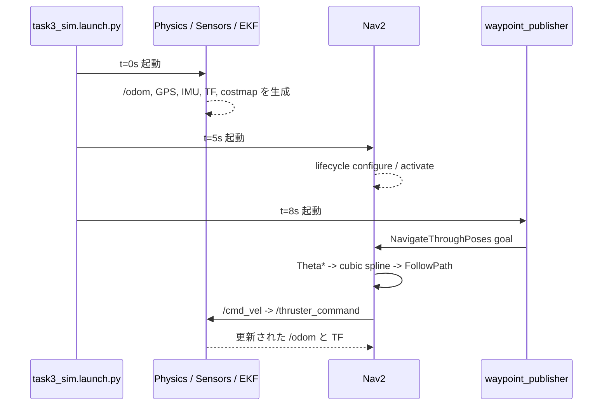
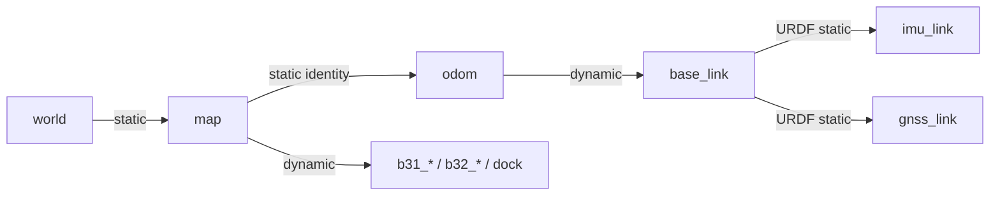
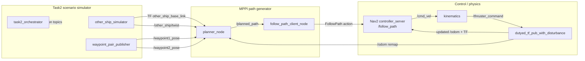

# Task3 シミュレーション構成と Task2 MPPI シミュレーション統合調査

調査日: 2026-06-15
対象リポジトリ: `IBO-ASV/njord2026_ws`

## 1. 調査対象

### oswystk15662 が最後に push したブランチ

リモートブランチをコミット日時順に確認した結果、`oswystk15662` が最後に push したブランチは次の通り。

- ブランチ: `origin/4-task1`
- HEAD: `18ab24535e67f8bd846aa3747875a82808f36418`
- 日時: 2026-06-06 03:18:18 +0900
- コミットメッセージ: `modi ctrl archi, add antigravity rule`

Task3 シミュレーションに直接関係する主なコミットは以下。

| commit | 内容 |
|---|---|
| `9f8d770` | Nav2 用 natural cubic spline smoother を追加 |
| `dd0c1ea` | Task3 シミュレーション向け変更 |
| `dd4a34a` | 7 -> 8 -> berth1 -> 8 -> 9 -> berth2 -> 10 の全 waypoint 列を追加 |
| `77d64f3` | buoy obstacle publisher、field boundary、Task3 Nav2 params を追加 |
| `4154adc` | センサ層、Nav2 層、goal 層の3段階起動を追加 |
| `e31390c` | TF authority を SimNode に集約、EKF の `publish_tf` を無効化 |
| `41d20f3` | rolling global costmap、turning radius、buoy inflation を調整 |
| `f481f46` | `task3_sim 動くけどうまくいかない` |

したがって、現状は「一括起動できるところまで統合されているが、挙動品質と一部実装に既知問題が残る状態」と判断するのが妥当。

### Task2 MPPI ブランチ

- ブランチ: `origin/add-mppi-for-task2`
- HEAD: `86422bee2dedc41c70f7b957043650e91996842d`
- 日時: 2026-06-12 14:02:52 +0900
- 主な追加物: `src/navigation/path_generator/mppi`

このブランチは `4-task1` の後続ではなく、共通祖先は `5040191`。
そのため、Task3 側で追加された一括 launch、waypoint publisher、natural cubic spline、Task3 用 Nav2 設定などを含んでいない。

---

## 2. Task3 シミュレーションの実行方法

### 前提環境

- Ubuntu 22.04
- ROS 2 Humble
- Nav2
- `robot_localization`
- Eigen
- この workspace を `colcon build` できること

最低限、以下の ROS パッケージが必要。

```bash
sudo apt update
sudo apt install \
  ros-humble-navigation2 \
  ros-humble-nav2-bringup \
  ros-humble-robot-localization \
  ros-humble-tf-transformations
```

依存関係を `package.xml` から解決する場合は、workspace 直下で以下を実行する。

```bash
source /opt/ros/humble/setup.bash
rosdep install --from-paths src --ignore-src -r -y
```

### build

```bash
cd ~/njord2026_ws
git switch 4-task1

source /opt/ros/humble/setup.bash
colcon build --symlink-install
source install/setup.bash
```

関連パッケージだけを build する場合:

```bash
colcon build --symlink-install --packages-select \
  dutyed_tf_pub_with_disturbance \
  sensor_sim_with_noise \
  task3_sim \
  kinematics \
  robot \
  waypoint_publisher \
  buoy_obstacle_publisher \
  natural_cubic_spline
source install/setup.bash
```

### Task3.1 の起動

```bash
ros2 launch task3_sim task3_sim.launch.py task_type:=task3_1
```

起動タイミングを変更する場合:

```bash
ros2 launch task3_sim task3_sim.launch.py \
  task_type:=task3_1 \
  driver_delay:=0.0 \
  nav2_delay:=5.0 \
  goal_delay:=8.0
```

### Task3.2 の起動

```bash
ros2 launch task3_sim task3_sim.launch.py task_type:=task3_2
```

ただし、現在の `task3_2` は最後まで自動実行できない。理由は後述する。

### 起動確認

別 terminal で毎回 workspace を source して確認する。

```bash
source /opt/ros/humble/setup.bash
source ~/njord2026_ws/install/setup.bash

ros2 node list
ros2 topic list
ros2 action list
ros2 action info /navigate_through_poses
ros2 topic echo /odom
ros2 topic echo /cmd_vel
ros2 topic echo /thruster_command
ros2 topic echo /sim/goal_reached
ros2 run tf2_tools view_frames
```

Nav2 の状態確認:

```bash
ros2 lifecycle get /planner_server
ros2 lifecycle get /smoother_server
ros2 lifecycle get /controller_server
ros2 lifecycle get /bt_navigator
```

期待値はすべて `active`。

---

## 3. Task3 シミュレーションの構成

### 一括 launch

入口は以下。

```text
src/sim/task3_sim/launch/task3_sim.launch.py
```

この launch は、シミュレーションに必要なノードを3段階で起動する。

1. `t=0s`: 物理、疑似センサ、TF、EKF、障害物、推力変換
2. `t=5s`: Nav2
3. `t=8s`: waypoint publisher

```mermaid
flowchart LR
    subgraph Goal["Goal layer: t=8s"]
        WP["waypoint_publisher<br/>NavigateThroughPoses client"]
    end

    subgraph Nav["Nav2 layer: t=5s"]
        BTN["bt_navigator"]
        TS["ThetaStarPlanner"]
        Spline["NaturalCubicSplineSmoother"]
        RPP["RegulatedPurePursuit"]
        VS["velocity_smoother"]
    end

    subgraph Sensor["Physics / sensor layer: t=0s"]
        T3["task3_orchestrator<br/>buoy TF / dock / pointcloud"]
        BO["buoy_obstacle_publisher<br/>/buoy_costmap"]
        FB["field_boundary_publisher"]
        PHY["dutyed_tf_pub_with_disturbance<br/>MMG + disturbance"]
        SNS["sensor_sim_with_noise<br/>GPS / IMU"]
        EKF["local EKF / global EKF / navsat"]
        KIN["kinematics<br/>cmd_vel -> thruster_command"]
    end

    WP -->|/navigate_through_poses| BTN
    BTN --> TS
    TS -->|raw Path| Spline
    Spline -->|smoothed Path| RPP
    RPP --> VS
    VS -->|/cmd_vel| KIN
    KIN -->|/thruster_command| PHY
    PHY -->|/odom| SNS
    PHY -->|TF odom -> base_link| T3
    SNS --> EKF
    T3 -->|buoy TF| BO
    T3 -->|/pointcloud| Nav
    BO -->|/buoy_costmap| Nav
    PHY -->|updated pose| Nav
```



### 起動シーケンス



### 経路生成と追従

Task3 の Nav2 パイプラインは以下。

1. `waypoint_publisher` が YAML から waypoint 列を読む。
2. `/navigate_through_poses` action を `bt_navigator` に送る。
3. BT XML 内の `ComputePathThroughPoses` が `GridBased` planner を呼ぶ。
4. `GridBased` の実体は `nav2_theta_star_planner/ThetaStarPlanner`。
5. `SmoothPath` が `natural_cubic_spline` plugin を呼ぶ。
6. `FollowPath` が `RegulatedPurePursuitController` を呼ぶ。
7. Nav2 が `/cmd_vel` を出す。
8. `kinematics` が `/cmd_vel` を `/thruster_command` に変換する。
9. `dutyed_tf_pub_with_disturbance` が推力、MMG、外乱を積分して `/odom` と TF を更新する。

### TF authority

現状のシミュレーションでは `dutyed_tf_pub_with_disturbance` が TF authority。



- `world -> map`: SimNode が static TF を publish
- `map -> odom`: SimNode が static TF を publish
- `odom -> base_link`: SimNode が dynamic TF を publish
- local/global EKF: `publish_tf: false`
- EKF は filtered odometry topic を出すが、TF authority ではない

### Task3 orchestrator

`task3_orchestrator` は以下を担当する。

- Task3.1 と Task3.2 の両方の buoy TF を周期 publish
- buoy に正弦波状の微小移動を付与
- dock TF と dock projection を publish
- dock と buoy を模擬した `/pointcloud` を `base_link` frame で publish
- `/sim/start` を publish
- `/odom` が goal 範囲に入ったら `/sim/goal_reached` を publish

### obstacle / costmap

- `/pointcloud`: local costmap の `ObstacleLayer`
- `/buoy_costmap`: local/global costmap の `StaticLayer`
- `/field_boundary_costmap`: publisher は存在する

注意: 現在の `nav2_params_task3.yaml` では `/field_boundary_costmap` を読む layer が設定されていないため、field boundary publisher を起動しても Nav2 の costmap には反映されない。

### waypoint state machine

`task3_1` は以下を順に実行する。

```text
Stage 1: GPS7 -> GPS8 -> berth1
Wait:    berth1 で 10 秒
Stage 2: GPS8_exit -> GPS9 -> berth2
Wait:    berth2 で 10 秒
Stage 3: GPS10
```

---

## 4. Task3 の既知問題と注意点

### 4.1 BT XML の絶対パス

`src/robot/config/nav2_params_task3.yaml` には以下のような絶対パスがある。

```text
/home/osw/njord2026_ws/install/robot/share/robot/config/...
```

workspace が `/home/osw/njord2026_ws` 以外にある場合、`bt_navigator` が BT XML を読めず起動に失敗する可能性が高い。

推奨対応:

- launch 側で `get_package_share_directory("robot")` からパスを生成する
- または実行環境を一時的に `/home/osw/njord2026_ws` に揃える

### 4.2 `task3_2` の waypoint 数と state machine が不一致

`task3_2_config` の waypoint は4点だが、state machine は `task3_1` と同じ7点構成を前提にしている。

- Stage 1 は先頭3点を送れる
- Stage 2 は `len(waypoints) >= 6` を要求するため実行不可
- Stage 3 は `len(waypoints) >= 7` を要求するため実行不可

`task3_2` を単独完走させるには専用 state machine を追加する必要がある。

### 4.3 X4 omni の sway 指令が kinematics で無視される

Nav2 の `velocity_smoother` は `linear.y` を許可しているが、現在の `kinematics` は以下しか使用していない。

- `msg->linear.x`
- `msg->angular.z`

`msg->linear.y` は推力配分へ反映されない。
そのため「holonomic / omni 向け」として設定した Nav2 の横移動指令は実船物理モデルまで届かない。

### 4.4 TF と filtered odometry の役割が重複気味

SimNode が `map -> odom -> base_link` を直接 publish している一方で、local/global EKF と navsat transform も起動している。

現状は TF 競合を避けるため EKF の `publish_tf` を無効化している。これはシミュレーションには有効だが、実機構成との差分を理解したうえで使用する必要がある。

### 4.5 `task3_sim 動くけどうまくいかない`

直近の Task3 関連コミット自身がこの状態を明記している。
「launch が立ち上がること」と「正しく docking を完走すること」は分けて確認する必要がある。

---

## 5. Task2 MPPI ノードの現在の入出力

`origin/add-mppi-for-task2` の `planner_node` は以下を要求する。

### Subscribe / TF / Publish

| 種別 | デフォルト名 | 型 | 用途 |
|---|---|---|---|
| Subscribe | `/own_ship/odom` | `nav_msgs/msg/Odometry` | 自船位置、姿勢、速度 |
| TF lookup | `base_link <- other_ship_base_link` | TF | 自船基準の他船位置、姿勢 |
| Subscribe | `/other_ship/twist` | `geometry_msgs/msg/TwistStamped` | 他船速度 |
| Subscribe | `/waypoint1_pose` | `geometry_msgs/msg/PoseStamped` | 経路基準点1 |
| Subscribe | `/waypoint2_pose` | `geometry_msgs/msg/PoseStamped` | 経路基準点2 |
| Publish | `/planned_path` | `nav_msgs/msg/Path` | map 基準の追従経路 |

`follow_path_client_node` は `/planned_path` を Nav2 の `/follow_path` action に送る。

### MPPI 内部

- planning frame: `base_link`
- output frame: `map`
- horizon: 225
- prediction dt: 0.1 s
- sample count: 5000
- CUDA が使える場合は CUDA、なければ CPU
- 出力 Path の spacing: 3.0 m

---

## 6. 現在の Task2 シミュレーションで不足しているもの

現在の `task2_sim.launch.py` が起動するのは以下だけ。

- `dutyed_tf_pub_with_disturbance`
- `task2_orchestrator`

`task2_orchestrator` が publish するのは以下。

- moving `red_buoy` TF
- moving `green_buoy` TF
- `/sim/marker_vessel_projection`
- `/sim/start`
- `/sim/goal_reached`

MPPI が要求する以下は publish されない。

- `/own_ship/odom`
- `other_ship_base_link` TF
- `/other_ship/twist`
- `/waypoint1_pose`
- `/waypoint2_pose`

また、MPPI の Path を船体運動へ戻すために必要な以下も `task2_sim.launch.py` では起動しない。

- Nav2 controller server
- `follow_path` action server
- `kinematics`
- sensor simulation / localization
- robot state publisher

### 現状の接続不成立点

| 項目 | 現状 | 必要な対応 |
|---|---|---|
| 自船 odometry topic | SimNode は `/odom` | MPPI を `/odom` に設定するか relay |
| 自船 odometry frame | `/odom` の pose は `odom` 基準 | `map == odom` 前提を明示するか TF で map へ変換 |
| 他船 pose | 生成ノードなし | `map -> other_ship_base_link` TF publisher を追加 |
| 他船 twist | 生成ノードなし | `TwistStamped` publisher を追加 |
| waypoint 2点 | 生成ノードなし | Task2 用 waypoint pair publisher を追加 |
| Path follower | MPPI branch に client はある | Nav2 controller server と同時起動する |
| 船体運動への反映 | task2 launch に kinematics なし | `kinematics` を追加 |
| 一括起動 | なし | `task2_mppi_sim.launch.py` を追加 |
| Python 依存 | `numpy` / `torch` が package metadata にない | requirements と package metadata を追加 |

---

## 7. Task2 MPPI シミュレーションに必要な目標構成



### 必須追加 1: other ship simulator

最低限、以下を同じ時刻基準で publish するノードが必要。

- TF: `map -> other_ship_base_link`
- `geometry_msgs/msg/TwistStamped`: `/other_ship/twist`

MPPI は `lookup_transform(base_link, other_ship_base_link)` を行うため、TF tree に以下が必要。

```text
map -> odom -> base_link
map -> other_ship_base_link
```

推奨パラメータ:

- 初期位置
- 初期 yaw
- surge speed
- yaw rate
- scenario: head-on / crossing / overtaking
- publish rate

### 必須追加 2: waypoint pair publisher

MPPI は PoseStamped 2点を個別 topic で要求する。

最低限:

- `/waypoint1_pose`
- `/waypoint2_pose`
- frame_id: `map`
- transient local QoS、または周期 publish

既存の `waypoint_publisher` は `NavigateThroughPoses` action client であり、MPPI 用 PoseStamped 2 topic は publishしない。別ノードまたは MPPI 用モードが必要。

### 必須追加 3: Task2 MPPI 一括 launch

Task3 と同様に一括 launch を作るべき。

推奨起動順:

1. Physics / TF / robot state publisher / kinematics
2. Other ship simulator / waypoint pair publisher
3. Nav2 controller server
4. MPPI planner / FollowPath client
5. operation validator

MPPI は自分で global planner を置き換えるため、Task2 では Nav2 全体の `bt_navigator + planner_server` は必須ではない。
ただし `/follow_path` action を提供する `controller_server`、costmap、lifecycle manager は必要。

### 必須追加 4: topic / frame 契約の統一

短期的には、MPPI launch の `own_odom_topic` を `/odom` に設定するのが最小変更。

```python
{
    "own_odom_topic": "/odom",
    "own_frame": "base_link",
    "other_ship_frame": "other_ship_base_link",
    "frame_id": "map",
}
```

ただし `TrajectoryGenerator._own_pose_in_map()` は Odometry の pose を無条件で map 基準として扱う。
現在は SimNode の `map -> odom` が identity のため見かけ上動くが、将来 `map -> odom` が非 identity になると誤る。

本来は以下のいずれかに修正すべき。

1. `/odometry/filtered/global` を入力し、pose が map 基準であることを保証する
2. Odometry の `header.frame_id` から `map` へ TF 変換する

### 必須追加 5: MPPI の runtime dependency

MPPI 実装は `numpy` と `torch` を import するが、現在の `package.xml` と `setup.py` に記載がない。

必要な対応:

- CPU / CUDA の対象環境を決める
- PyTorch の導入方法を README に固定する
- `numpy` の互換バージョンを固定する
- 起動前 smoke test を追加する

例:

```bash
python3 -c "import numpy, torch; print(numpy.__version__, torch.__version__, torch.cuda.is_available())"
```

---

## 8. MPPI 実装側でシミュレーション前に直すべき点

### 優先度 High

1. `require_other_ship:=false` が実質動かない

   `other=None` の場合でも `others = [other]` として MPPI に渡すため、内部で `None` を船舶状態として参照する可能性がある。

2. 角速度の単位が不整合

   `VesselState` の説明では `r` は deg/s。
   しかし自船 Odometry の `angular.z` は rad/s のまま格納される。他船側は deg/s に変換されるため、同じ計算内で単位が一致しない。

3. 自船 pose を map 基準と仮定している

   Odometry の `header.frame_id` を確認せず map pose として扱っている。

4. 他船 Twist の座標系契約が曖昧

   `other_twist_is_relative=True` がデフォルトだが、`TwistStamped.header.frame_id` を使った座標変換はない。
   「自船 base_link 基準の相対速度」か「map 基準の絶対速度」かを明文化し、実装でも検証する必要がある。

5. MPPI branch が Task3 統合資産を削除している

   `add-mppi-for-task2` をそのまま基準ブランチにすると、`4-task1` の waypoint publisher、natural cubic spline、task launch、Task3 Nav2 config などが消える。
   MPPI package だけを統合するか、競合を確認しながら merge する必要がある。

### 優先度 Medium

1. 5000 samples x 225 horizon を 2 Hz で回す性能確認が必要
2. `debug=True` で全予測配列を毎回 CPU/Numpy へコピーしており負荷が高い
3. `__pycache__` が Git に含まれている
4. maintainer、email、README、パラメータ YAML が未整備
5. 自動 test が planner の topic / TF 契約を検証していない

---

## 9. 推奨する実装順序

### Phase 1: MPPI 単体 smoke test

1. MPPI package を `4-task1` へ統合
2. `numpy` / `torch` を導入
3. 固定 `/odom`、固定他船 TF、固定他船 Twist、固定 waypoint 2点を publish
4. `/planned_path` が 2 Hz で出ることを確認
5. Path の `frame_id == map` と pose 数を確認

確認:

```bash
ros2 topic hz /planned_path
ros2 topic echo /planned_path --once
```

### Phase 2: FollowPath 閉ループ

1. Nav2 controller server を起動
2. `follow_path_client_node` を起動
3. `/cmd_vel` が出ることを確認
4. `kinematics` と SimNode を接続
5. `/odom` が変化することを確認

確認:

```bash
ros2 action info /follow_path
ros2 topic hz /cmd_vel
ros2 topic hz /thruster_command
ros2 topic hz /odom
```

### Phase 3: moving other ship

1. other ship simulator を追加
2. head-on / crossing / overtaking をパラメータ化
3. TF と Twist の時刻、frame、単位を統一
4. DCPA / TCPA と collision の validator を追加

### Phase 4: 再現可能な一括 launch

以下を1コマンドで起動できる状態にする。

```bash
ros2 launch task2_sim task2_mppi_sim.launch.py scenario:=crossing
```

---

## 10. 完了条件

Task2 MPPI シミュレーションが成立したと判断する最低条件:

- [ ] 1コマンドで全ノードが起動する
- [ ] TF tree が分断・競合していない
- [ ] `/odom`、他船 TF、他船 Twist、waypoint 2点が継続的に入力される
- [ ] `/planned_path` が map frame で周期 publish される
- [ ] `/follow_path` が Path を受理する
- [ ] `/cmd_vel` -> `/thruster_command` -> `/odom` の閉ループが成立する
- [ ] 他船との衝突がない
- [ ] head-on / crossing / overtaking の各 scenario を再現できる
- [ ] CPU または GPU 上で planning 周期を維持できる
- [ ] rosbag と validator log で結果を比較できる

---

## 11. 結論

Task3 は `4-task1` ブランチ上で、以下の構成により一括シミュレーションできる。

```text
waypoint_publisher
  -> Nav2 NavigateThroughPoses
  -> ThetaStarPlanner
  -> NaturalCubicSplineSmoother
  -> RegulatedPurePursuit
  -> cmd_vel
  -> kinematics
  -> thruster_command
  -> MMG / disturbance simulation
  -> odom / TF
```

Task2 MPPI は Path 生成ノードと FollowPath client までは実装されているが、現状の `task2_sim` には MPPI が必要とする他船 TF、他船 Twist、waypoint 2点、Nav2 controller、kinematics、一括 launch がない。

最短の方針は、`4-task1` を統合基盤として維持し、`add-mppi-for-task2` から `src/navigation/path_generator/mppi` のみを取り込み、Task2 用 scenario publisher と一括 launch を追加すること。
