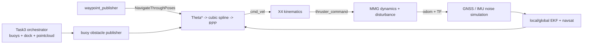

# Task3 Navigation and Simulation

## Run

Build and source the workspace, then launch either Task3 mode:

```bash
ros2 launch task3_sim task3_sim.launch.py task_type:=task3_1
ros2 launch task3_sim task3_sim.launch.py task_type:=task3_2
```

Startup delays can be overridden:

```bash
ros2 launch task3_sim task3_sim.launch.py \
  task_type:=task3_1 driver_delay:=0.0 nav2_delay:=5.0 goal_delay:=8.0
```

## Architecture



The launch uses three startup layers:

1. physics, sensors, Task3 environment, kinematics, EKF, and obstacle grids;
2. Nav2 after TF and filtered odometry become available;
3. waypoint publication after Nav2 action servers become active.

## TF ownership

The simulation dynamics node is the sole Task3 simulation authority for:

```text
world -> map -> odom -> base_link
```

Both EKF nodes use `publish_tf: false` and publish filtered odometry topics
only. On the real robot, GLIM owns the equivalent dynamic TF chain.

## Navigation

Task3 uses a dedicated Nav2 configuration:

- `ThetaStarPlanner` for holonomic planning;
- natural cubic spline smoothing;
- Regulated Pure Pursuit without rotate-to-heading;
- X4 kinematics with surge, sway, and yaw commands;
- dynamic buoy obstacles from TF frames.

## Validation boundary

The files and package metadata are statically checked in this Windows
environment. GitHub CI builds the affected ROS packages. End-to-end behavior,
timing, docking accuracy, and controller tuning still require ROS 2 simulation
execution.
